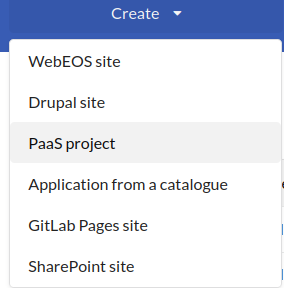
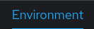

# CERN OAuth 2.0 SSO NodeJS Proxy

This will run on OpenShift as a proxy to your application (which can run on OpenStack).

It takes care of authenticating users using keycloack/OIDC, getting their id, email, name and roles 
and passing them onto the application running on CLIENT_URL.

If you include an API_URL environment variable, it will also route `/api/\*` to the API_URL (with all HTTP possible methods, `GET`, `POST`, `PUT`, ...)

Note: Roles are different from egroups. See [here](https://auth.docs.cern.ch/applications/role-based-permissions/) for details.

## Environment Variables

Environment variables that configure the proxy's execution. You can set those either by running `export <VAR>=<VALUE>` or by setting them in an `.env` file. See [`.env_sample`](.env_sample).

> **Warning**
> To set those variables in Deployment, see [here](#setting-enviroment-variables)


| Environment Variable | Required | Description |
| -------------------- | -------- | ------------------------- |
| `CLIENT_URL`    | true     | The URL you want to proxy |
| `CLIENT_ID`     | true     | The client id you get from [CERN AUTH](#create-an-sso-registration-and-mapping-roles-to-e-groups) |
| `CLIENT_SECRET` | true     | The client secret you get from [CERN AUTH](#create-an-sso-registration-and-mapping-roles-to-e-groups) |  
| `API_URL`       | false    | If you're also running an API and you want to re-use this proxy, passing this environment variable will redirect all requests that go to the proxy's `/api/\*` endpoint to the `API_URL` you provided. |
| `SERVER_PORT`   | false    | The port that the proxy listens to, defaults to `8080` |
| `SERVER_TIMEOUT`| false    | The server's timeout in ms, see [here](https://nodejs.org/api/http.html#serversettimeoutmsecs-callback) | 
| `ENV`           | false    | The type of environment the proxy is running to. Set to `development` for extra console messages. | 
| `DEBUG`         | false    | Accepts a comma-separated list of node modules to enable debugging information for. Example value: `http,express:*` to enable debugging messages for `http` and `express`. |
| `NODE_ENV`      | false    | Sets the mode for the `express` server. Set to `development` when developing. ` |

> **Note**
> For deployment, more env vars (such as `NPM_RUN` which lets you specify the `npm run` command to run), specific to the NodeJs s2i image can be found [here](https://github.com/sclorg/s2i-nodejs-container/tree/master/14#readme).

## Development instructions

### Running the project locally

1. Make sure you have `node` version 16.
2. Create an `.env` file in the root of the project, using `.env_sample` as a template.
3. ```bash
    npm install
    npm run dev
    ```
4. While not strictly needed, you will also need to have started the RunRegistry bakend and frontend processes on separate terminals. 
5. Connect to http://localhost:8080
## Deployment instructions

### Creating a deployment on OpenShift

#### Create a PaaS project

1. Request a webpage in: [CERN Web Services](https://webservices.web.cern.ch/webservices/).

    > **Warning**
    > Login as user `cmsdqm`.

    

2. Set the type, name of project and description:

    

3. Go to the `OKD console` as instructed. There, click `Topology`:

    > **Warning**
    > Login as user `cmsdqm`.

    

4. Right-click and select `Add to Project` -> `Import from Git`

    

5. Input the git repo url:

    

6. Select the appropriate `NodeJS` version. As of writing (2023/06), version `nodejs:16-ubi8` is used. 

7. Edit the routing options, making sure you enter the `Hostname` that you want, *without* `http(s)://` in front.

    


8. Go to the `Administrator` view:

    


9. Click `Networking` -> `Routes`

    

10. Go to the `Route` that has been created and click `Edit annotations`:

    

11. Add `haproxy.router.openshift.io/ip_whitelist` as `Key` and leaving the `Value` field empty.

13. You can edit the value `haproxy.router.openshift.io/timeout` key to match the timeout value of the server (see [env vars](#environment-variables)).  

14. Go to the Project page on PaaS (e.g. https://paas.cern.ch/k8s/cluster/projects/dev-cmsrunregistry) and click the plus icon, top right:
    
    

15. A text editor will open. Paste the following inside: 
    ```yaml
    apiVersion: webservices.cern.ch/v1alpha1
    kind: OidcReturnURI
    metadata:
        name: dev-cmsrunregistry-return-uri
    spec:
        redirectURI: RETURN_URI
    ```
    Replace `RETURN_URI` with the complete redirect URI to the homepage of your application (e.g. `https://dev-cmsrunregistry.web.cern.ch`)
16. Click `Create`.
17. Note that the deployment is not yet ready to run.

#### Create an SSO registration and mapping roles to e-groups

1. Login as `cmsdqm` to the [Application Portal](https://application-portal.web.cern.ch/).
2. Click `Add an Application`:

    

3. Fill in the information as shown:

    

    Make sure you add `cms-dqm-coreteam` as the `Administrator Group`.

    Click `Create`.
4. Click the `SSO Registration` tab and then the plus sign:

    

5. Fill in the SSO Registration form as follows:

    

    > **Note**
    > Make sure you click the green plus sign to add the redirect URL.

6. Click `Submit`:

    

    A `client id` and a `client secret` will have been created. Take note of them.

7. Back to the `My Applications` page of the portal, click the green edit button next to your registration:

    

8. Repeat for each e-group needed (see the `Permssion` table of the RunRegistry DB for a complete list):
    
    1. Under the `Roles` tab, click `Add Role`:
        
        
    
    2. Fill in the form, using the e-group's name for each of the fields:

        

    3. Click the green bunch of people icon:

        

    4. Use the name of the e-group to link it to the role you just created:

        

#### Setting enviroment variables

Back to the PaaS project. 

1. Go to `Builds`:

    

2. Click on your `BuildConfiguration`:

    

3. Click the `Environment` tab:

    

4. Create an entry for each env variable, as needed (see [env vars](#environment-variables)):

    


    > **Note**
    > The `CLIENT_ID` and `CLIENT_SECRET` are the values you noted at step 6 [here](#create-an-sso-registration-and-mapping-roles-to-e-groups)

5. Under `Actions` on the top right, click `Start build`:

    
